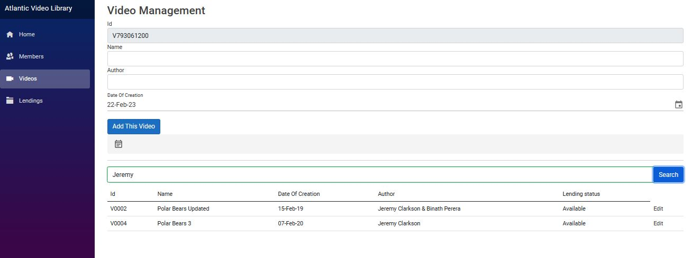
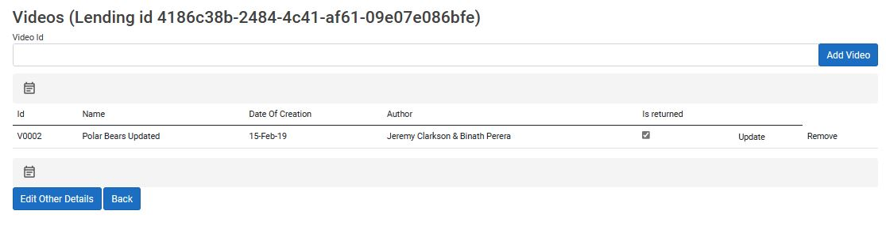
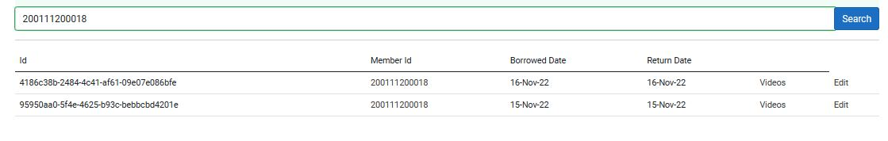

# AtlanticVideoLibrary1

## User Documentation

### Home

Home page with support link to contact the developer

### Members

This tab can be used to manage library members.

* **Add Member**

Auto generated ID. System date is set as date of registration by default.

* **Update Member**

Select edit on the respective row that you need to update. 
The edit form will be shown.
Here you will see the options to update, delete or go back to the initial view.

* **Search Member**

The search box can be used to search through any attribute of a member.

* **Delete Member**

Once you are in the edit form of a given member you will have the option to delete.

### Videos

This tab can be used to manage all videos.

* **Add Video**

Video ID will be auto generated.
Date of creation will show the system date by default.
In addition to video information such as Name,Date Of Creation	and Author the lending status of the video will also be shown.
Upon addition, the form will reload with a new video id.

* **Update Video**

Select edit on the respective row that you need to update. 
The edit form will be shown.
Here you will see the options to update, delete or go back to the initial view.

* **Search Video**

The search box can be used to search through any attribute of a video.

* **Delete Video**

### Lendings

* **Add Lending**

Enter video id and select add video. If the video is not borrowed by someone else
you will be able to add the video. If it is borrowed the lending ID of that 
lending will be displayed.

Select the respective remove button to remove the video from the table.

When you have selected the videos for the lending click on Add This Lending

* **Update lending details**

In the table view select edit.

The edit form will be loaded. The option to update will be shown.

* **Update videos in any given lending**

To do this you have 2 paths. Select Videos in the table view or
Select edit in the table view and then select 'Videos in this lending'

Here you can add new videos, update existing ones and also toggle the 
return status of a certain book in that lending.

* **Search for Lending details**

Use the search bar to search for a lending

* **Delete Lending details**

In the table view select edit.

The edit form will be loaded. The option to delete will be shown.

## Database Documentation

### ER Diagram

### Tables

### Stored Procedures**

## Installation Instructions

1. Restore database backup using the backup file (AtlanticVideoLibrary.bak) . This can be done using the SQL Server Management Studio. 
2. Open the solution using Visual Studio Code
3. Set the database connection string in each Data.Service file.

